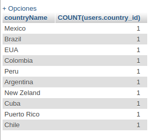
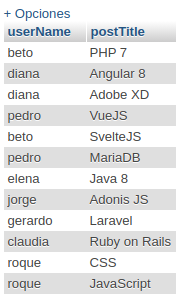
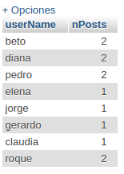

# Base de datos de Prueba
Esta carpeta contiene un volcado de la base de datos proporcionada por el profesor en la cual se corrigieron los siguientes errores:
- Sintaxis en la creación de las tablas
- Corrección de nombre y referencia en la taba *users*

## Consultas
1. Obtener **todos** los países con la cantidad de publicaciones asociadas

2. Obtener el listado de países con el conteo de usuarios registrados por cada uno
    Sentencia:

    

    Resultado:

    

3. Obtener las publicaciones de cada usuario

    Sentencia:

    `SELECT users.userName, posts.postTitle FROM users JOIN posts ON users.id = posts.user_id`

    Resultado:

    

4. Obtener el conteo de publicaciones de cada usuario

    Sentencia:

    `SELECT users.userName, COUNT(posts.id) AS nPosts FROM users JOIN posts ON users.id = posts.user_id GROUP BY posts.user_id`

    Resultado:

    

5. Obtener solo los usuarios con sus publicaciones, cuando estos tengan arriba de 3 publicaciones registradas

    Sentencia:

    `SELECT users.userName, COUNT(posts.user_id) AS nPosts FROM posts JOIN users ON posts.user_id = users.id GROUP BY posts.user_id HAVING COUNT(posts.user_id) > 3`

    Resultado: 0 registros
